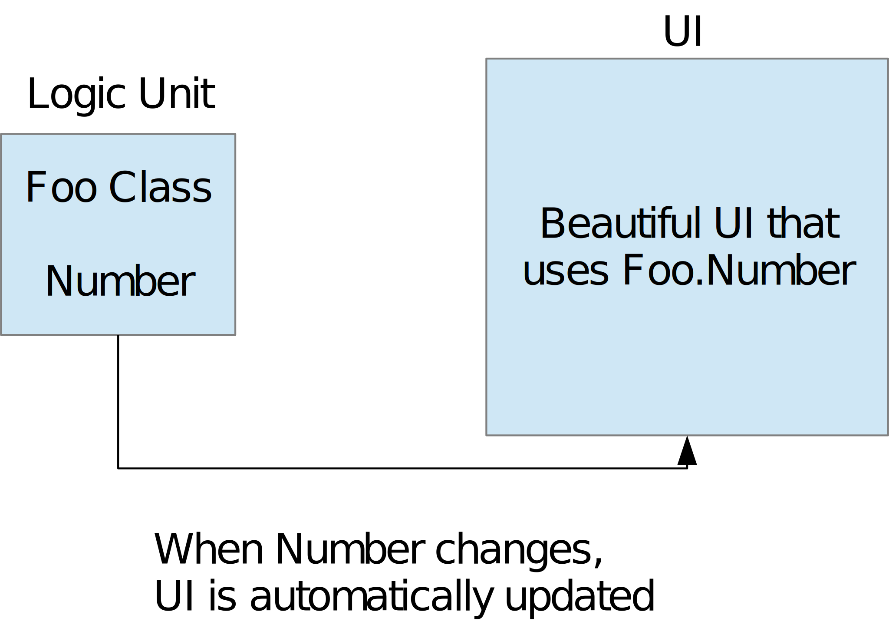
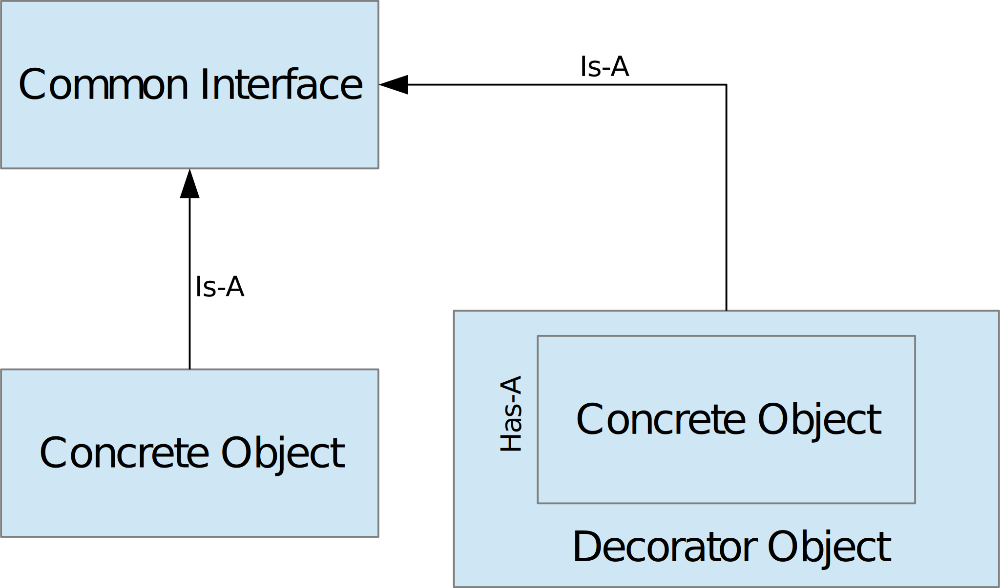
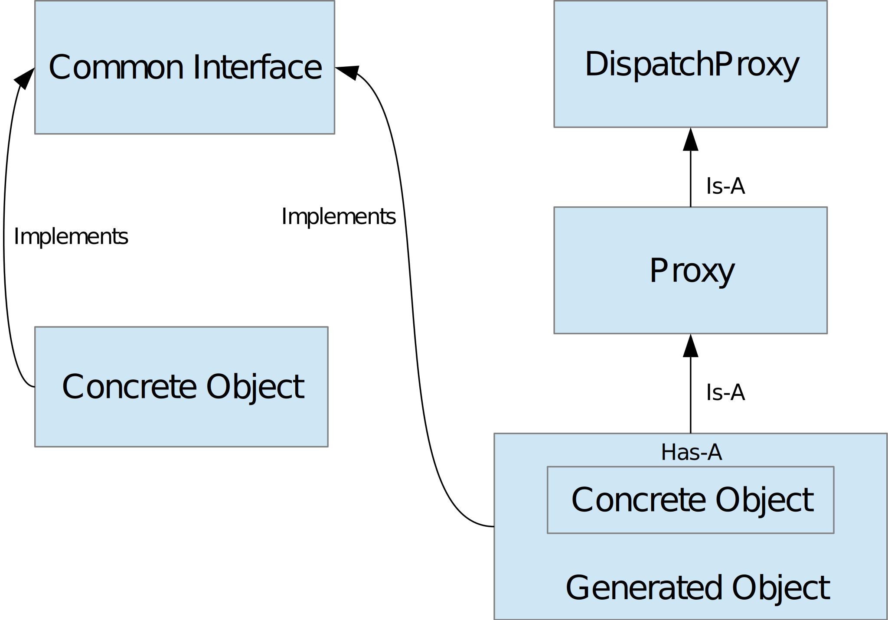
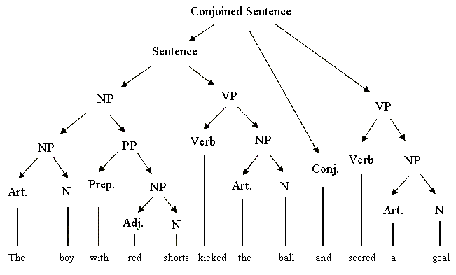

# Introduction

In this article I'm going to explain what I now consider to be a common problem  
among c# application developers. I'll delve into depth with various concepts  
that I needed to tackle in order to solve the initial problem I'm going to describe,  
and I'll also provide a complete solution with code explanations and a library project for you to use.  
Our target environment is going to be *.net standard 2.0*.  

So, in this article we shall see:

- An introduction to the MVC pattern and INotifyPropertyChanged
- The decorator pattern
- DispatchProxy and AOP (Aspect Oriented Programming)
- C# Expression Trees and Reflection Optimizations
- The Observer Class

# A quick glance on MVC

MVC is a quite common pattern, based on a simple idea.  
The separation of program logic and UI pressentation.  
In this article, I won't go into details,  
but I provide a wikipedia article at the bottom, for anyone interested.  
Instead, I will focus on what background idea I need for this article.  

Consider the following class...

	public class Foo {

		public int Number{ get; set; } = 0;

	}

A pretty simple class with a single property, which holds the data our UI is  
going to need, to somehow pressent to the user.  
Ideally, I would like to somehow connect my separate UI code to this class.  
So when Number changes, the UI should be automatically updated, without  
Foo having any idea about the UI related code.  

Now this pattern has a few benefits, but one I find particularly useful is unit testing.    
Since the UI simply reflects the state of the Logic unit, the UI is irrelevant to the  
program logic itself.  
User interaction with the UI still affects program state of course,  
but the effect flow is as shown below.  

This means we can now unit test our program logic, without paying any attention to the UI.  

See [this](https://en.wikipedia.org/wiki/Model%E2%80%93view%E2%80%93controller) wikipedia article for more details.

# INotifyPropertyChanged

In the above presentation, we assumed that each time the logic unit's state changes,  
so does the UI get updated. One way to achieve this is, by setting up an event  
listener on the UI's end, and firing relevant events from the logic unit  
each time a change occurs on one of its properties.  

This sounds like a lot of work. Luckily, WPF for example, has mechanisms to  
automate most of it. In fact, only a tiny part of that work is left on the hands of  
the developer, and by the end of the article, hopefully, we shall know how to minimize even that.

INotifyPropertyChanged is an interface which is part of the .Net Standard.  
An implementation of INotifyPropertyChanged on the above class Foo would look like this:

	public class Foo : INotifyPropertyChanged {

		public event PropertyChangedEventHandler PropertyChanged;

		private int number = 0;
		public int Number{ 
			get => number;
			set {
				if(number == value) return;
				number = value;
				PropertyChanged?.Invoke(this, new PropertyChangedEventArgs(nameof(Number)));
			}
		}
		
	}

So we see that INotifyPropertyChanged only requires us to setup an event.  
Whenever a property is altered, with the above set block code, we can  
fire an event to anyone bound to PropertyChanged handler, and provide the  
name of the altered property.

You might wonder, why use INotifyPropertyChanged, instead of your own, custom interface.  
And the answer is that this is the default way to do it, and consistency means  
other developers will find your code easier to navigate.

Another reason is that WPF and Xamarin for example, with the use of bindings  
can use this specific Interface to track changes to your logic unit,  
and automatically update the UI.

This, of course, is tremendously important, when implementing the MVVM pattern,  
which for all we care on this article, is similar to the MVC pattern above.

# Defining the problem

I think the problem we are going to solve, is already visible, if one pays attention.  
We simply have to take a look at the initial Foo class.

	public class Foo {

		public int Number{ get; set; } = 0;

	}

And then, let's have another look at the class implementing INotifyPropertyChanged.

	public class Foo : INotifyPropertyChanged {

		public event PropertyChangedEventHandler PropertyChanged;

		private int number = 0;
		public int Number{ 
			get => number;
			set {
				if(number == value) return;
				number = value;
				PropertyChanged?.Invoke(this, new PropertyChangedEventArgs(nameof(Number)));
			}
		}
		
	}

That's a lot of code... Boilerplate code. The problem scales aggressively,  
relative to the number of properties we end up having. It is not uncommon for an  
object to need to have tens of properties.

The code becomes too much, and as you can image the possibility of error  
increases with the lines of code. Now image the common as well scenario,  
that you have multiple objects, with multiple properties each.  

Not only the codebase scales, but you also have to type the same thing all the time,  
which is, frankly, annoying... And after all this typing, you end up with a robust program  
which implements a very simple idea... Again, and again...

Alternatively, I would like to have to type something like this to solve the above problem:

	public class Foo : INotifyPropertyChanged {

		public event PropertyChangedEventHandler PropertyChanged;

		[NotifyProperty]
		private int Number{ get; set; } = 0;
		
	}

Much better... Let's see how this could be done.

# The Decorator Pattern

The decorator pattern is pretty straightforward.  
Consider having a few classes that share some functionality and thus they  
implement the same interface. Like the Food and Calorie example below.

	public interface IHasCalories {
		int Calories{ get; }
	}

	public abstract class Food : IHasCalories {
		public abstract int Calories{ get; }
	}

	public class Pizza : Food {
		public override int Calories{ get => 500; }
	}

	public class Broccoli : Food {
		public override int Calories { get => 50; }
	}

Each food type has a calories property, and each one returns a different value.  

The decorator pattern simply describes a wrapper class that further modifies  
the initial common functionality, and thus it *'decorates'* the existing classes.

	public class HugePortion : IHasCalories {
		private IHasCalories caloriePossesor;

		public HugePortion(IHasCalories caloriePossesor) {
			this.caloriePossesor = caloriePossesor;
		}

		public int Calories {
			get => caloriePossesor.Calories * 2;
		}
	}

	public class WithExtraCheese : IHasCalories {
		private IHasCalories caloriePossesor;

		public WithExtraCheese(IHasCalories caloriePossesor) {
			this.caloriePossesor = caloriePossesor;
		}

		public int Calories {
			get => caloriePossesor.Calories + 250;
		}
	}

As you can see, *HugePortion* and *WithExtraCheese* implements the *IHasCalories* interface.  
Each of them also has a constructor that accepts an object of type *IHasCalories*.  
So they in a way *are* an *IHasCalories* object, and they also *have* an *IHasCalories* object.  

When a decorator object is tasked with providing calories, the base value comes from the  
actual object, and then it is further modified by the decorator. The decorator,  
cannot return a value if there's no decorated object to get the initial value from.

Intuitively, it makes no sense to have the calories of a huge portion, unless you are referring  
to a specific kind of food, like pizza or broccoli.  
Yet again, once food is decorated, you can refer to it simply as a common calorie bearing item,  
through the common interface *IHasCalories*.

The nice thing about the above pattern is that you can further decorate an *IHasCalories* object,  
even if the object to be decorated, is a decorator itself!  
Consider the following example:

	IHasCalories food = new WithExtraCheese(new HugePortion(new Pizza()));

Now this is a huge portion of a pizza with extra cheese.  
First the *Pizza* object is created, then it is decorated by *HugePortion*, which is further  
decorated by *WithExtraCheese*, and the final food item is referred to as an *IHasCalories* object.  

When *food.Calories* is requested,  
*'WithExtraCheese'* calls *'HugePortion.Calories'* which calls *'Pizza.Calories'*.  
*'Pizza.Calories'* returns 500 to *'HugePortion'*, which doubles that and returns 1000 to *'WithExtraCheese'*,  
which adds another 250 calories, and finally *'food.Calories'* responds with an abundant 1250 calories.

And finally a generic and simplified way to see the pattern...

# The DispatchProxy class

Based upon the principles of the Decorator pattern, the DispatchProxy class exists to provide  
a more generic way to alter the functionality of our concrete classes.  
DispatchProxy is an abstract class, which means we have to extend it.  
I shall be calling the extended class, simply **Proxy**.

The Proxy class is very simple, it inherits a single abstract method *Invoke*  
from its parent DispatchProxy, and a static generic method, *Create*, as shown below.

	public class Proxy : DispatchProxy {
		protected override object Invoke( MethodInfo targetMethod, object[] args ) {
			
		}
	}

	public static T Create<T,TProxy> () where TProxy : System.Reflection.DispatchProxy;

Those two are the only building blocks we are going to need to create wrapper objects  
with specific functionality for any object type.  

Remember the previous example with food. The decorator object needed to implement the  
same Interface as the object it wrapped.

What if I wanted to decorate many different types of objects with different interfaces,  
with the same functionality? A very common use for such a problem is logging.  
You would like your objects to log to a file each of their method invocations.  

So a simplistic way to do it, would be to implement that functionality on every method of each one  
of your objects. As you can imagine this quickly becomes bloated, frustrating, and error prone.  
Another way, would be to implement the decorator pattern for each different object.  
This is viable, but you'd still have to repeat the same code for each method,  
and a different decorator for each object.

I hope the problem is clear. Let's see how the above Proxy class works now.  
I actually prefer to declare my Proxy class like this:

	class Proxy<ObjectType, ObjectInterface>  : DispatchProxy 
		where ObjectType : ObjectInterface{

		private ObjectType instance;

		protected override object Invoke( MethodInfo targetMethod, object[] args ) {
			
		}

		static public ObjectInterface Generate(ObjectType instance) {
			ObjectInterface proxy = DispatchProxy.Create
				<ObjectInterface, Proxy<ObjectType, ObjectInterface>>();
			(proxy as Proxy<ObjectType, ObjectInterface>).instance = instance;
			return proxy;
		}
	}

Note how I made my Proxy a generic class, taking two generic type parameters.  
Firstly, the **ObjectType** (that should translate as the concrete class in your mind),  
and secondly, **ObjectInterface** (that should translate as the common interface  
shared between the decorator and the concrete class in your mind).  

I also made my proxy class keep an instance of the actual concrete class object.  
This might prove handy in the future.

And finally, let's see the Generate method. The Generate method somehow connects  
three separate entities. The Proxy class, the concrete class, and the common interface.

**The DispatchProxy.Create method, generates** dynamically at runtime,   
**an object that's derived from Proxy class and implements ObjectInterface.**  

We don't actually know or care exactly what that generated object is, all we care about  
is that we can use it as if it were a Proxy object (which actually it is through inheritance),  
and we can also use it as the common interface, since we know that it implements it.  

**When the returned generated object** (that we, in our application can work with  
through the common interface) **invokes a method, what is actually invoked is the Proxy.Invoke method.**

The Proxy.Invoke method gets as an argument a MethodInfo object related to the actual  
method of the ObjectType that should have been invoked. And as you image, args are the actual  
method arguments that were passed when the method invocation took place.

Let's see a simple example to make things clear.

	public interface CommonInterface {
		void PrintHello();
	}

	public class ConcreteClass : CommonInterface {

		public void PrintHello() {
			Console.WriteLine("Hello");
		}

	}

The above snippet should require no explanation, we have our ConcreteClass with a simple  
method, that's also declared in the CommonInterface that it implements.

	public class Proxy<ObjectType, ObjectInterface>  : DispatchProxy 
		where ObjectType : ObjectInterface{

		private ObjectType instance;

		protected override object Invoke( MethodInfo targetMethod, object[] args ) {
			Console.WriteLine("Calling " + targetMethod.Name);
			object result = targetMethod.Invoke(instance, args);
			Console.WriteLine("Called " + targetMethod.Name);
			return result;
		}

		static public ObjectInterface Generate(ObjectType instance) {
			ObjectInterface proxy = DispatchProxy.Create
				<ObjectInterface, Proxy<ObjectType, ObjectInterface>>();
			(proxy as Proxy<ObjectType, ObjectInterface>).instance = instance;
			return proxy;
		}
	}

The Proxy class is exactly the same as before, with its invoke method implemented too.  
So in this example, before the target method gets invoked, we print to the console  
the method to be invoked. Then, through reflection we call the target method  
of the concrete object. Finally, we print the name of the method just invoked.

Note that the original method invocation through the decorated object was  
altered in no way, as expected.

	ConcreteClass concrete = new ConcreteClass();
	CommonInterface decorated = Proxy<ConcreteClass, CommonInterface>.Generate(concrete);
	decorated.PrintHello();

The above snippet of code creates a Concrete class, generates the decorated object,  
and through it, calls the method defined in the common interface that prints hello.  
As mentioned before, the method actually invoked is Proxy.Invoke, which in turn  
calls through reflection the target method.  

The above snippet prints:  
Calling PrintHello  
Hello  
Called PrintHello  

So to sum it all up, with DispatchProxy, we solved a common problem (logging)  
on all methods of every object, by generating dynamically at runtime a decorator.  
We only had to define an interface to our class(es) if it didn't already exist.  

# DispatchProxy Invoke Optimizations

As great as DispatchProxy is, it comes with a steep cost in performance.  
Each method invocation makes use of reflection, which is, in fact,
quite slow compared to normal method invocations.

Ideally, we'd be able to call the correct target method directly, without  
the use of reflection, by passing an array of object arguments to it as parameters.  
So our invocation method would be something like this:

	private static Dictionary<MethodInfo, Func<object, object[], object>> MethodsMappings { get; }

	protected override object Invoke( MethodInfo targetMethod, object[] args ) {
		Console.WriteLine("Calling " + targetMethod.Name);
		object result = MethodsMappings[targetMethod].Invoke(instance, args);
		Console.WriteLine("Called " + targetMethod.Name);
		return result;
	}

First take a look at the dictionary MethodMappings. This dictionary simply maps  
a MethodInfo to a Func<object, object[], object> delegate, which accepts an object and an array  
of objects as parameters and returns an object.  
(The last generic type is the return type of the delegate)

This is a pretty generic delegate. Its first argument is the concrete class that the invoked  
method belongs to. Its second argument is the arguments that Proxy.Invoke provides us with  
for the method invocation, and its return type is an object with the real return value  
of invoked method.

A delegate is fast, no less fast on average than a method invocation, and certainly  
much faster than reflection. But what is the delegate's body?  
We somehow want it to execute the original method, upon the concrete object.

The problem here is we have no idea about the original method's signature,  
but in order to not have some kind of reflection or argument types deduction of some sort,  
we are going to need solid types of delegates, like the above Func.

Let's see what we would do if we knew the type of the target method.  
Suppose we have the following concrete method.

	public class ConcreteClass : CommonInterface {

		public int Sum(int x, int y) {
			return x+y;
		}

	}

If we knew what type of method we would be calling, we could simply create the generic  
Func<object, object[], object> above, and instantiate it like this:  

	Func<object, object[], object> func = (object instance, object[] args) => {
		int x = (int) args[0];
		int y = (int) args[1];

		return (object) (instance as ConcreteClass).Sum(x, y);
	};

So as we see, our generic Func object acts as a wrapper to our actual method.  

For anyone unfamiliar with the above syntax, the func is instantiated with a lambda  
expression, which you can think of as an unnamed function.  
The syntax consists of 3 parts, the arguments, the lambda declarator, and the body.  
The following is a simple lambda function: 

	() => { }

This is a function with no arguments that does nothing, note the **'=>'** is the lambda declarator  
syntax to create a delegate. The parentheses declare the arguments, similar to how a method does,  
and the brackets declare the function body.  

So, if we could create variations of the above Func<object, object[], object> wrapper object depending  
on the target method each time at runtime, we could implement our Proxy.Invoke method as above. 

The benefit is we'd have two delegate invocations (fast) instead of an invocation through reflection (slow).  
We'd have to setup the dictionary once for each concrete type (slow initialization),  
but afterwards we can use the decorated objects with almost no extra invocation cost of their methods.

# Expression Trees

For anyone having had a compilers class at university, expression trees should be pretty  
straightforward, at least theoretically.  
Expression trees are the way .Net creates a syntax tree at runtime, from which it can compile  
executable chunks of code that reside on memory.

An example of a syntax tree in the English language is provided below.

As you can see there are lots of intermediate nodes that make ever higher level expressions  
up to the root of the tree. Similarly, when a compiler parses the source code, it creates such  
hierarchical structures to "*make sense*" of it.

Getting into more details would be too much for this article, so I'm just going  
to describe why this is useful to us to solve the above problem.

Let's focus on the fact that **an expression tree can be created and compiled at runtime**  
**to provide executable chunks of code**.  

In other words, expression trees can provide us with methods, or delegates, which are  
generated at runtime. So in the problem above, couldn't we simply create an appropriate  
Func<object, object[], object> object wrapper of our method?  
Yes we could. In fact, we could extract the parameters and return type of any method from  
its MethodInfo, and generate a wrapper specifically for it.

Once the generated Func object is returned, we could never know exactly what lies below  
the shell that's our wrapper class, and we don't need to know, as long as the target method  
invocation is ultimately correct.  

# The Delegate Generator Class

This class is going to be key in our implementation. It only has a simple thing to do.  
Get a MethodInfo as an argument and generate a generic delegate of it.  
The class' public method is straightforward.  

		public static class DelegateGenerator {

			public static Func<object, object[], object> GenerateDetached(MethodInfo method, object instance) {
				//...
			}

		}

And that's really all there is to it. The internal functionality does require a little bit of work,  
as someone has to check every possible method signature and generate the approptiate expression tree.  
I am not going to provide it in detail here. Source code is your best bet if you need more details.  
Instead, I will explain the basic idea of how this class, and expression trees work.

So, assume we have the following class:

	public class ConcreteClass : CommonInterface {

		public int Sum(int x, int y) {
			return x+y;
		}

	}

We will try to emulate the following behavior, using expression trees:

	Func<object, object[], object> func = (object instance, object[] args) => {
		int x = (int) args[0];
		int y = (int) args[1];

		return (object) (instance as ConcreteClass).Sum(x, y);
	};

Remember, that this Func<object, object[], object> is actually what our DelegateGenerator returns.  
So if we know how to create that at runtime using expression trees, our work is done.  
And the way to do that, is pretty straightforward using Expression Trees.

		//our object initialization
		ConcreteClass obj = new ConcreteClass();

		//The received parameter type, the type received by "final"
		ParameterExpression outer = Expression.Parameter(typeof(object[]));

		//A call expression
		var call = Expression.Call(
			Expression.Constant(obj), //param 0 : the object that the call is associated with
			obj.GetType().GetMethod("Sum"), //param 1 : the methodInfo using reflection
			//param 2 : a conversion of the received outer[0] from object type to int type, expression
			Expression.Convert(Expression.ArrayIndex(outer, Expression.Constant(0)), typeof(int)),
			//param 3 : a conversion of the received outer[1] from object type to int type, expression
			Expression.Convert(Expression.ArrayIndex(outer, Expression.Constant(1)), typeof(int))
		);

		//the body of our lambda, which is an expression that uses the previously
		//defined call expression, and converts its return type (int) to object
		var body = Expression.Convert(call, typeof(object));

		//our callable, compiled, lambda expression
		//that receives an array of objects and returns object
		var final = Expression.Lambda<Func<object[], object>>(
			body, outer).Compile();

		//Calling our delegate, which prints 8 as expected
		Console.WriteLine(final.Invoke(new object[]{ 3, 5 }).ToString());

So, with the above example, we managed to create the desired delegate at runtime, using expression trees.  
The basic idea is pressented in this minor example. Finding all the required method signature information  
is simply then a matter of effort, using reflection, to create the appropriate "generic" delegate of any method.  
The source code, that does exactly that, is already provided.  

Microsoft provides detailed documentation on expression trees, [here](https://docs.microsoft.com/en-us/dotnet/csharp/programming-guide/concepts/expression-trees/)

# Proxy class optimization

Remember our Proxy class.  

	public class Proxy<ObjectType, ObjectInterface>  : DispatchProxy 
		where ObjectType : ObjectInterface{

		private ObjectType instance;

		protected override object Invoke( MethodInfo targetMethod, object[] args ) {
			//...
		}

		static public ObjectInterface Generate(ObjectType instance) {
			//...
		}
	}

When a new Proxy type is initialized for the first time, we actually (through reflection),  
have all the information we need (all the class types, and their associated method types),  
to generate the appropriate Dictionary which maps methodInfo types, to the generic delegates we  
created using DelegateGenerator. So when invoke is called by our decorated method,  
we don't actually need to use reflection!  
We can just use reflection once per proxy type, to initialize our dictionary!  
This is a huge optimization! Since reflection is so much slower than delegates.  
We handle all the initialization code, in Proxy's static constructor.  

# The Observer class

The techniques we discussed above, can be used to solve a great variety of problems.  
But our initial objective was to be able to decorate our classes with appropriate Attributes,  
to automatically fire the INotifyPropertyChanged event, as shown below.  

		public class Foo : INotifyPropertyChanged {

			public event PropertyChangedEventHandler PropertyChanged;

			[NotifyProperty]
			private int Number{ get; set; } = 0;

		}

The Observer class, can be used to do exactly that. It is a Proxy class (derived from DispatchProxy),  
which generates, just as we did before, a decorated class that wraps the concrete class.  
As before, its methods and properties are accessed through the returned interface, but,  
the Observer class makes sure, that when a property is altered (set), the ObservedChanged event is fired.  

I will provide an example of the whole proccess, to make things clear.  

		//the decorator interface has to be derived from IObserver
		public interface IFoo : IObserver{
			
			//The [Observe] attribute has to be used on every property that requires observation
			//aka: to fire the appropriate event when altered.
			[Observe]
			Number { get; set; }

		}

		//The concrete class has to define its interface, IFoo
		public class Foo : IFoo {

			public int Number{ get; set; } = 0;

			//This method has to be defined. Observation can be used to do any type of action, as desired.
			//Including, but not limited to, firing the INotifyPropertyChanged event, we discussed earlier.
			public void ObservedChanged( string propertyname ) {
				//take action when an observed property changed.
			}

		}

The following snippet provides a usage example:  

	//concrete object creation
	Foo concreteObject = new Foo();

	//decorated object instantiation
	IFoo decorated = Observer<Foo, IFoo>.GenerateProxy(original);

	//This would invoke ObservedChanged
	decorared.Number = 5;

# Epilogue

I hope you found this article to be useful. Remember, I provide a complete implementation of  
everything discussed above, with unit testing, on Github. Other projects aim to have a similar  
functionality, but my implementation is not dependent on any external packages,  
just pure C# and .net standard 2.